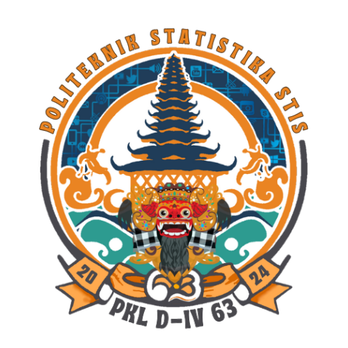

# DOKUMENTASI

<a name="readme-top"></a>

<!-- PROJECT LOGO -->
<br />
<div align="center">
  <a href="#">
    
  </a>

  <h3 align="center">Web Monitoring PKL D-IV 63</h3>

  <p align="center">
    Subdivisi Web Monitoring , Divisi SPD , Bidang IT
    <br />
  </p>
</div>

<!-- TRIBUTE TO -->
<details>
  <summary>Tribute To</summary>
  <ol>
    <li>
        Ketua SPD : Muhammad Julian Firdaus <a>222112217@stis.ac.id</a> (3SI1)
    </li>
    <li>
        Subdivisi CAPI dan Server Tercinta
    </li>
    <li>
        Tim Web Monitoring yang telah membuat web monitoring
        <ul>
            <li>Ridho Pangestu <a>222011585@stis.ac.id (3SI3) </a></li>
            <li>Pandu Wahyu Aji <a>222011392@stis.ac.id (3SI2) </a></li>
            <li>Aliefta Zulvansyah B <a>222111873@stis.ac.id (3SI1)</a></li>
            <li>Sonya Ananta Panjaitain <a>222011469@stis.ac.id (3SD3) </a></li>
            <li>Nur Yudha Jati Prakoso <a>222011469@stis.ac.id (3SD3) </a></li>
        </ul>
    </li>
        <li>
        Teman-teman Bayangan Web monitoring yang turut membantu membangun web ini
        <ul>
            <li> 
             Muhammad Diva Amrullah <a>222112210@stis.ac.id (3SI1)</a>
            </li>
             <li> 
            Irsyad Fadhil Asyraf <a>222112116@stis.ac.id (3SI1)</a>
            </li>
               <li> 
            Agus Riyanto <a>222111855@stis.ac.id (3SI2)</a>
            </li>
              <li> 
            Dutatama Rosewika Taufiq Hadihardaya <a>222111997@stis.ac.id (3SD2)</a>
            </li>
        </ul>
         <li>
        Teman-teman SPD lainnya
        <ul>
            <li> 
             Rifky(3SI1), Zein(3SI1), Rista (3SI1), Danang (3SI2), Alpin (3SI2), Ima (3SI2), Yulius (3SI2), Falana (3SI3),Sari (3SI3)
            </li>
        </ul>
    </li>
  </ol>
</details>

<!-- TABLE OF CONTENTS -->
<details>
  <summary>Daftar Isi</summary>
  <ol>
    <li>
      <a href="#about-the-project">Tentang Web Monitoring</a>
      <ul>
        <li><a href="#built-with">Dibangun Dengan</a></li>
      </ul>
    </li>
    <li>
      <a href="#getting-started">Prasyarat dan Instalasi</a>
      <ul>
        <li><a href="#prerequisites">Prasyarat</a></li>
        <li><a href="#installation">Instalasi</a></li>
      </ul>
    </li>
    <li><a href="#sw">Konten Web Monitoring</a></li>
    <li>
      <a href="#ks">Kendala dan Saran</a>
      <ul>
        <li><a href="#kendala">Kendala</a></li>
        <li><a href="#saran">Saran</a></li>
      </ul>
    </li>
    <li><a href="#gambar">Gallery</a></li>
  </ol>
</details>

<!-- ABOUT THE PROJECT -->

<a name="about-the-project"></a>

## Tentang Web Monitoring

Web Monitoring adalah aplikasi untuk memantau progres listing dan pencacahan setiap kajian pada setiap riset pada kegiatan Praktik Kerja Lapangan (PKL) Politeknik Statistika STIS tahun akademik 2024/2025. Semoga dengan adanya dokumentasi dapat membantu dalam pengembangan Web Monitoring untuk PKL angkatan berikutnya.

<a name="built-with"></a>

### Dibangun Dengan

Web Monitoring PKL D-IV 63 tahun 2024 dibangun dengan beberapa teknologi

- [![next.js][Next]][Next-url]
- [![tailwind][TailwindCSS]][tailwind-url]
- [![Express.js][Express.js]][Express-url]
- [![Nodemon][Nodemon]][Nodemon-url]
- [![Node js][Node]][Node-url]
- [![PostgreSql][Postgres]][Postgre-url]
- [![JQuery][Leaflet]][Leaflet-url]

<p align="right">(<a href="#readme-top">back to top</a>)</p>

<!-- GETTING STARTED -->

<a name="getting-started"></a>

## Prasyarat dan Instalasi

<a name="prerequisites"></a>

### Prasyarat

Database yang digunakan web monitoring meliputi `database capi ` dan `database khusus webmon` . Untuk link backup databasenya bisa dilihat [disini.](https://git.stis.ac.id/fosil-spd-pkl/62/backup-database-pkl-62)

<a name="installation"></a>

### Instalasi

#### Clone dulu web service webmon pada link berikut `https://git.stis.ac.id/fosil-spd-pkl/63/web-service-webmon` (ikuti sesuai readmenya)

#### Setelah berhasil clone web service lalu kita clone project ini dengan menjalankan command command berikut :

```
git clone https://git.stis.ac.id/fosil-spd-pkl/63/web-service-webmon
```

```
npm install
```

- copy file .env.local.example lalu hapus .examplenya (.env.local saja)

```
npm run dev
```

- buka di browser dengan alamat `localhost:3000`

<p align="right">(<a href="#readme-top">back to top</a>)</p>

<!-- Konten Web Monitoring -->

<a name="sw"></a>

## Konten Web Monitoring

- [x] <a href="#dlogin"> Login </a>
- [x] <a href="#d1"> Dashboard </a>
- [x] Menu Per Riset
  - [x] Daftar
    - [x] <a href="#d2"> Daftar Listing </a>
    - [x] <a href="#d3"> Daftar Sampel </a>
    - [x] <a href="#d4"> Daftar Pertim </a>
  - [x] Progress
    - [x] <a href="#d5"> Progress Wilayah </a>
    - [x] <a href="#d6"> Progress Pertim </a>
- [x] <a href="#d7"> Lokasi PPL </a>
- [x] <a href="#d8"> FAQ </a>
- [x] <a href="#d9"> Profile </a>

Untuk lihat screenshot website secara keseluruhan dapat dilihat
<a href="#gambar">
disini
</a>

Untuk konten yang ditampilkan itu didapat dari database mana, berikut penjelasannya :

- Untuk mengambil akun login untuk web monitoring, lihat dari tabel `user` pada database `pkl62_monitoring`
- Untuk mengambil daftar listing , lihat dari tabel `rumahtangga` pada database `pkl_wilayah`
- Untuk mengambil daftar sampel , lihat dari tabel `datast` pada database `pkl_wilayah`
- Untuk mengambil daftar sampel yang telah selesai dicacah (ada pada data ODK) , lihat dari tabel `kuesioner_core` pada database `aggregate`
- Untuk mencocokan sampel yang ada di database `pkl_wilayah` dan sampel yang selesai pada `aggregate`, PKL D-IV 62 menggunakan indikator `kode blok sensus` dan `nomor urut rumah tangga` yang ada pada kedua tabel

<p align="right">(<a href="#readme-top">back to top</a>)</p>

<!-- KENDALA DAN SARAN -->

<a name="ks"></a>

## Kendala dan Saran

<a name="kendala"></a>

### Kendala

- Query yang digunakan untuk mengambil sampel yang selesai dicacah kurang optimal, sehingga tidak dapat di handle oleh server
- Beberapa riset memiliki request pada hari-h PKL

<a name="saran"></a>

### Saran

- Gunakan LARAVEL, CodeIgniter 4 tidak cukup powerful
- Jika masih menggunakan CodeIgniter 4, lakukan optimasi query supaya tidak membebani server.
- Sarankan ke subdivisi CAPI, di ODKAggregate atau di database `aggregate` itu tolong include column `kodeRuta`. sehingga dapat dengan mudah dicocokkan sama database `pkl_wilayah`. Alhasil sampel yang telah dicacah dapat diidentifikasi dengan mudah
- Kerjakan apa yang bisa dikerjakan, jangan tunggu-tungguan sama CAPI. kalau database nya belum ada, teman-teman bisa membuat template front end nya dulu
- Kalau bisa tambahkan fitur lain seperti eligible per wilayah , eligible per tim, dan lain sebagainya.
- Perbagus UI, Utamakan UX

<p align="right">(<a href="#readme-top">back to top</a>)</p>

<a name="gambar"></a>

## Gallery

<!-- GALLERY NYA BISA DI FOLD BIAR ENAK -->
<details>
  <summary>Foto</summary>

<a name="d0"></a>

### Desain Awal

![desainawal][desainawal]

<p align="right">(<a href="#sw">Another Konten</a>)</p>

<a name="dlogin"></a>

### Login

![login][login]

<p align="right">(<a href="#sw">Another Konten</a>)</p>

<a name="d1"></a>

### Dashboard

![dashboard_1][dashboard_1]
![dashboard_1a][dashboard_1a]
![dashboard_2][dashboard_2]
![dashboard_2a][dashboard_2a]

<p align="right">(<a href="#sw">Another Konten</a>)</p>

<a name="d2"></a>

### Daftar Listing

![listing1a][listing1a]
![listing1b][listing1b]
![listing1c][listing1c]
![listing1d][listing1d]

<p align="right">(<a href="#sw">Another Konten</a>)</p>

#### Detail Listing

![detail_listing][detail_listing]
![detail_listingnext][detail_listingnext]

<p align="right">(<a href="#sw">Another Konten</a>)</p>

<a name="d3"></a>

### Daftar Sampel

![sampel1a][sampel1a]
![sampel1b][sampel1b]
![sampel1c][sampel1c]
![sampel1d][sampel1d]

<p align="right">(<a href="#sw">Another Konten</a>)</p>

#### Sampel Spesial

![sampelspecial][sampelspecial]

<p align="right">(<a href="#sw">Another Konten</a>)</p>

#### Detail Sampel

![detail_sampel][detail_sampel]
![detail_sampelnext][detail_sampelnext]

<p align="right">(<a href="#sw">Another Konten</a>)</p>

<a name="d4"></a>

### Daftar Pertim

![tim1a][tim1a]
![tim1b][tim1b]
![tim1_detail][tim1_detail]

<p align="right">(<a href="#sw">Another Konten</a>)</p>

<a name="d5"></a>

### Progress Wilayah

![pwilayah1a][pwilayah1a]
![pwilayah1b][pwilayah1b]
![pwilayah1c][pwilayah1c]

<p align="right">(<a href="#sw">Another Konten</a>)</p>

<a name="d6"></a>

### Progress Tim

![ptim][ptim]

<p align="right">(<a href="#sw">Another Konten</a>)</p>

<a name="d7"></a>

### Lokasi PPL

![posisipcl][posisipcl]

<p align="right">(<a href="#sw">Another Konten</a>)</p>

<a name="d8"></a>

### FAQ

![faq][faq]

<p align="right">(<a href="#sw">Another Konten</a>)</p>

<a name="d9"></a>

### Profile

![profile][profile]

<p align="right">(<a href="#sw">Another Konten</a>)</p>

</details>

<p align="right">(<a href="#readme-top">back to top</a>)</p>

<!-- LINK IMAGES -->

[dashboard_1]: public/dokumentasi/dashboard_1.png
[dashboard_1a]: public/dokumentasi/dashboard_1a.png
[dashboard_2]: public/dokumentasi/dashboard_2.png
[dashboard_2a]: public/dokumentasi/dashboard_2a.png
[desainawal]: public/dokumentasi/desainawal.png
[detail_listing]: public/dokumentasi/detail_listing.png
[detail_listingnext]: public/dokumentasi/detail_listingnext.png
[detail_sampel]: public/dokumentasi/detail_sampel.png
[detail_sampelnext]: public/dokumentasi/detail_sampelnext.png
[faq]: public/dokumentasi/faq.png
[listing1a]: public/dokumentasi/listing1a.png
[listing1b]: public/dokumentasi/listing1b.png
[listing1c]: public/dokumentasi/listing1c.png
[listing1d]: public/dokumentasi/listing1d.png
[posisipcl]: public/dokumentasi/posisipcl.png
[profile]: public/dokumentasi/profile.png
[ptim]: public/dokumentasi/ptim.png
[pwilayah1a]: public/dokumentasi/pwilayah1a.png
[pwilayah1b]: public/dokumentasi/pwilayah1b.png
[pwilayah1c]: public/dokumentasi/pwilayah1c.png
[sampel1a]: public/dokumentasi/sampel1a.png
[sampel1b]: public/dokumentasi/sampel1b.png
[sampel1c]: public/dokumentasi/sampel1c.png
[sampel1d]: public/dokumentasi/sampel1d.png
[sampelspecial]: public/dokumentasi/sampelspecial.png
[tim1_detail]: public/dokumentasi/tim1_detail.png
[tim1a]: public/dokumentasi/tim1a.png
[tim1b]: public/dokumentasi/tim1b.png
[login]: public/dokumentasi/login.png
[Next]: https://img.shields.io/badge/Next-black?style=for-the-badge&logo=next.js&logoColor=white
[Next-url]: https://nextjs.org/
[Nodemon]: https://img.shields.io/badge/NODEMON-%23323330.svg?style=for-the-badge&logo=nodemon&logoColor=%BBDEAD
[Express.js]: https://img.shields.io/badge/express.js-%23404d59.svg?style=for-the-badge&logo=express&logoColor=%2361DAFB
[Express-url]: https://expressjs.com/
[Nodemon-url]: https://nodemon.io/
[Postgre-url]: https://www.postgresql.org/
[TailwindCSS]: https://img.shields.io/badge/tailwindcss-%2338B2AC.svg?style=for-the-badge&logo=tailwind-css&logoColor=white
[Postgres]: https://img.shields.io/badge/postgres-%23316192.svg?style=for-the-badge&logo=postgresql&logoColor=white
[Node]: https://img.shields.io/badge/node.js-6DA55F?style=for-the-badge&logo=node.js&logoColor=white
[Node-url]: https://nodejs.org/en/download
[tailwind-url]: https://tailwindcss.com/
[JQuery.com]: https://img.shields.io/badge/jQuery-0769AD?style=for-the-badge&logo=jquery&logoColor=white
[JQuery-url]: https://jquery.com
[Leaflet]: https://img.shields.io/badge/leaflet.js-7DCD85?style=for-the-badge&logo=leaflet&logoColor=white
[Leaflet-url]: https://leafletjs.com/
